# LORX: High-Performance Go Load Balancer

A lightweight, high-performance, concurrent Layer 4 TCP load balancer written in Go. Because LORX operates at the TCP layer (Layer 4), it is entirely protocol-agnostic and serves as a general-purpose proxy capable of balancing **HTTP, HTTPS (TLS Passthrough), WebSockets, gRPC, PostgreSQL, MySQL, Redis, SSH**, and any other traffic running over TCP.

LORX features dynamic runtime configuration reloading, active background health checking, background DNS re-resolution, multi-threaded `SO_REUSEPORT` socket reuse, strict per-IP connection limits, and token-bucket rate limiting.

---

## Connection Lifecycle & Architecture

LORX acts as a reverse proxy between TCP clients and backend application servers. Below is the workflow diagram depicting connection flow, background workers, and dynamic configuration watches:

```mermaid
graph TD
    Client[Client Connection] --> Listener{ListenReusePort}
    Listener -- Windows / Fallback --> StdListen[Standard TCP Listener]
    Listener -- Linux --> ReusePort[SO_REUSEPORT Listener per CPU Core]

    StdListen & ReusePort --> LimitListener{Active Conns < maxConnections?}
    LimitListener -- No --> Block[Wait / Queue in OS TCP Backlog]
    LimitListener -- Yes --> RateLimiter{Allow IP via Token Bucket?}

    RateLimiter -- No --> Drop[Drop Connection / Linger 0]
    RateLimiter -- Yes --> WorkerGroup[Spawn wg.Go Goroutine]

    WorkerGroup --> IPSlots{Conns per IP <= maxConcurrentConnectionsPerIP?}
    IPSlots -- No --> Drop
    IPSlots -- Yes --> SelectAlg{Balancing Mode?}

    SelectAlg -- roundRobin --> RR[Round Robin Algorithm]
    SelectAlg -- ipHash --> Hash[FNV-1a Hash client IP]
    SelectAlg -- leastConnections --> LC[Min Connections Server]

    Hash --> HashHealthy{Hashed Server Healthy?}
    HashHealthy -- Yes --> Target[Target Backend]
    HashHealthy -- No --> LC
    RR --> Target
    LC --> Target

    Target --> ConnLimit{Backend Connections < maxConnections?}
    ConnLimit -- No --> Drop
    ConnLimit -- Yes --> Dial[Dial Backend TCP Address]

    Dial --> KeepAlive{Configure KeepAlives?}
    KeepAlive -- Yes --> SetKA[Apply TCP Keep-Alive Config]
    KeepAlive -- No --> ProxyProto{Proxy Protocol Enabled?}
    SetKA --> ProxyProto

    ProxyProto -- Yes --> InjectProxy[Inject PROXY Header v1/v2]
    ProxyProto -- No --> Tunnel[Bidirectional Tunnel / copyWithIdleTimeout]
    InjectProxy --> Tunnel

    Tunnel --> CopyLoop[Recycle 32KB Buffers via sync.Pool]
    CopyLoop --> End[Close Connections & Free IP Slots]

    subgraph ConfigManager ["Configuration Manager"]
        FSNotify[fsnotify Watcher on config.json] --> Reload[Hot Reload Settings at Runtime]
    end

    subgraph BackgroundWorkers ["Background Workers"]
        HC[Active Health Checker] -- TCP Ping --> MarkUpDown[Mark Backend Up/Down]
        DNS[DNS Re-resolver] -- LookupHost --> UpdateIP[Update IP Atomically]
    end

    %% Alignment constraints to center the two background jobs horizontally below the main graph
    End ~~~ FSNotify
    End ~~~ DNS

    classDef rectClass fill:#eef2f6,stroke:#475569,stroke-width:2px,color:#1e293b;
    classDef diamondClass fill:#fef3c7,stroke:#d97706,stroke-width:2px,color:#78350f;

    class Client,StdListen,ReusePort,Block,Drop,WorkerGroup,RR,Hash,LC,Target,Dial,SetKA,InjectProxy,Tunnel,CopyLoop,End,FSNotify,Reload,HC,MarkUpDown,DNS,UpdateIP rectClass;
    class Listener,LimitListener,RateLimiter,IPSlots,SelectAlg,HashHealthy,ConnLimit,KeepAlive,ProxyProto diamondClass;
```



---

## Key Features

### 1. Dynamic Configuration Reloading

The `ConfigManager` uses `fsnotify` to watch `config.json` for updates. When modified, it reloads settings (including backend pools, balancing algorithms, and rate limits) at runtime without requiring a process restart.

### 2. Multi-Threaded `SO_REUSEPORT` Listening

- **Linux**: Automatically sets the `SO_REUSEPORT` socket option and spawns multiple listeners (one per CPU core) to load balance connection acceptance at the kernel level for maximum throughput.
- **Windows / Other OS**: Safely falls back to a standard TCP listener.

### 3. Rate Limiting & Concurrency Control

- **Global Limit**: Restricts active concurrent connections using `golang.org/x/net/netutil.LimitListener`.
- **Per-IP Concurrent Limits**: Limits concurrent connections from a single IP via `maxConcurrentConnectionsPerIP` to guard against DDoS or resource exhaustion.
- **Token-Bucket Rate Limiter**: Leverages `golang.org/x/time/rate` to restrict connection rates per client IP (`connectionRateLimitPerMinute`).
- **OS-Level Pre-Routing Limit (Linux)**: Includes `iptables-rate-limit.sh` to restrict connection rates at the kernel firewall level (dropping IPs exceeding 100 new connections per 60 seconds) before they hit the Go process, preventing file descriptor and TCP socket backlog exhaustion.

### 4. Zero-Allocation Buffer Pooling

Proxies data bidirectionally between client and backend sockets. Rather than allocating fresh byte slices on every transfer, it recycles 32 KB buffers using a global `sync.Pool` to minimize GC pressure.

### 5. Hostname DNS Re-resolution

Target hostnames are periodically resolved in the background. If backend IPs change dynamically (e.g., in Kubernetes or auto-scaled environments), LORX updates target IPs atomically. If a backend connection fails, an immediate hostname resolution is triggered.

### 6. Keep-Alives & Idle Timeouts

- **TCP Keep-Alives**: Supports configuring TCP keep-alive idle times, intervals, and retry counts (`tcpKeepAlive`) to quickly detect and close dead peer sockets.
- **Idle Timeout**: Monitored on all copy operations; automatically shuts down a connection if no bytes are transferred in either direction within the `idleTimeoutMs` window.

### 7. PROXY Protocol Support

Supports injecting **PROXY Protocol v1** and **PROXY Protocol v2** headers onto upstream connections, preserving the client's original IP and port for backend servers.

---

## Project Structure

```
LORX/
├── main.go                      # Main entrypoint (initialization, ticker loop & HTTP pprof server)
├── bootstrap.go                 # Logger configuration & graceful shutdown handler
├── config.json                  # Application configurations
├── conn_test.go                 # Integration test suite for load balancer routing
├── iptables-rate-limit.sh       # Firewall-level rate limiting script for Linux iptables
├── config/                      # Configuration management module
│   ├── balanceMode.go           # Balancing mode types and validation (roundRobin, leastConnections, ipHash)
│   ├── config.go                # Configuration schema and loading/validation
│   ├── configManager.go         # Hot reload observer using fsnotify
│   ├── lbLevel.go               # Load balancer level definitions (TCP/UDP, HTTP)
│   ├── proxyProtocol.go         # PROXY protocol configuration & validation
│   ├── runtime.go               # Runtime state wrapper (config & backend pool)
│   ├── tcpKeepAlive.go          # TCP keep-alive configuration & validation
│   └── tls.go                   # TLS mode validation (passthrough, inspect, terminate, re-encrypt)
├── infra/                       # Infrastructural modules
│   └── rateLimit.go             # Token-bucket rate limiter per IP using x/time/rate
├── l4/                          # Layer 4 load balancing logic
│   ├── connectionErrors.go      # Custom network/syscall error classification
│   ├── dns.go                   # Periodic DNS re-resolution for backend endpoints
│   ├── handleBalanceMode.go     # Routing strategy dispatch helper
│   ├── handleConn.go            # Tunneling/proxying logic (bidirectional copy with idle timeout & keep-alives)
│   ├── handleConnError.go       # Specific connection error handler and backend eviction
│   ├── handleProxy.go           # PROXY protocol headers injector (v1 & v2)
│   ├── healthCheck.go           # Active background health checking
│   ├── index.go                 # LoadBalancer definition & global sync/buffer pools
│   ├── listen.go                # Platform-agnostic standard TCP listener
│   ├── listen_linux.go          # Optimized SO_REUSEPORT multi-threaded listener for Linux
│   └── listen_windows.go        # Fallback standard listener implementation for Windows
├── resources/                   # Core shared backend resources
│   └── backends.go              # Backend/Pool structs, Robin counters, and balancing algorithms
└── utils/                       # Utility packages
    ├── resolveUrls.go           # DNS host & scheme resolution helpers
    └── resolveUrls_test.go      # Unit tests for URL/host resolution
```

---

## Configuration (`config.json`)

Configure LORX via `config.json` in the root directory:

```json
{
  "backends": [
    {
      "address": "http://localhost:3000",
      "maxConnections": 100000
    },
    {
      "address": "http://localhost:3001",
      "maxConnections": 100000
    }
  ],
  "balanceMode": "roundRobin",
  "maxConnections": 120000,
  "maxConcurrentConnectionsPerIP": 2,
  "connectionRateLimitPerMinute": 1000000,
  "idleTimeoutMs": 500000,
  "dnsRefreshIntervalMs": 15000,
  "tls": "passthrough",
  "proxyProtocol": {
    "enabled": false,
    "version": 2
  },
  "healthCheck": {
    "intervalMs": 5000,
    "failureThreshold": 3,
    "successThreshold": 1
  },
  "tcpKeepAlive": {
    "enabled": true,
    "idleMs": 60000,
    "intervalMs": 10000,
    "count": 5
  },
  "debug": false
}
```

### Options Breakdown

| Key                             | Type       | Description                                                                                                                      |
| :------------------------------ | :--------- | :------------------------------------------------------------------------------------------------------------------------------- |
| `backends`                      | `[]object` | Array of target backends. Each object requires an `address` (string) and a `maxConnections` (int) limit.                         |
| `balanceMode`                   | `string`   | Load balancing algorithm. Options: `roundRobin`, `leastConnections`, `ipHash`.                                                   |
| `maxConnections`                | `int`      | Maximum active concurrent connections allowed globally.                                                                          |
| `maxConcurrentConnectionsPerIP` | `int`      | Maximum concurrent connections allowed per client IP.                                                                            |
| `connectionRateLimitPerMinute`  | `int`      | Maximum rate of connection attempts allowed per client IP per minute.                                                            |
| `idleTimeoutMs`                 | `int`      | Inactivity duration in milliseconds after which connection is closed.                                                            |
| `dnsRefreshIntervalMs`          | `int`      | Interval in milliseconds between background DNS lookups for hostnames.                                                           |
| `tls`                           | `string`   | TLS configuration behavior. Options: `passthrough`, `inspect`, `terminate`, `re-encrypt`.                                        |
| `proxyProtocol`                 | `object`   | Configures PROXY protocol wrapper headers. Contains `enabled` (bool) and `version` (int: `1` or `2`).                            |
| `healthCheck`                   | `object`   | Configures backend active health checking. Contains `intervalMs` (int), `failureThreshold` (int), and `successThreshold` (int).  |
| `tcpKeepAlive`                  | `object`   | Configures TCP socket-level keep-alive checks. Contains `enabled` (bool), `idleMs` (int), `intervalMs` (int), and `count` (int). |
| `debug`                         | `bool`     | Enables verbose connection logging (connection metrics, dial times, transfer bytes).                                             |

---

## Protocol Use Cases & Configuration Examples

### 1. HTTP / HTTPS & WebSockets (Web Applications)

Use `ipHash` for session stickiness (essential for keeping WebSocket connections pinned to the same backend host) and `tls: "passthrough"` to let the backends handle TLS decryption directly.

```json
{
  "backends": [
    { "address": "http://web-server-1:80", "maxConnections": 10000 },
    { "address": "http://web-server-2:80", "maxConnections": 10000 }
  ],
  "balanceMode": "ipHash",
  "maxConnections": 20000,
  "maxConcurrentConnectionsPerIP": 20,
  "connectionRateLimitPerMinute": 120,
  "idleTimeoutMs": 60000,
  "tls": "passthrough",
  "proxyProtocol": { "enabled": false, "version": 2 },
  "healthCheck": {
    "intervalMs": 5000,
    "failureThreshold": 3,
    "successThreshold": 1
  },
  "tcpKeepAlive": {
    "enabled": true,
    "idleMs": 30000,
    "intervalMs": 10000,
    "count": 3
  }
}
```

### 2. Database Load Balancing (PostgreSQL / MySQL)

Use `leastConnections` to route new queries to the replica with the lightest load. Disable the idle timeout (`null`) so database connection pools can keep connections warm.

```json
{
  "backends": [
    { "address": "postgres://db-replica-1:5432", "maxConnections": 100 },
    { "address": "postgres://db-replica-2:5432", "maxConnections": 100 }
  ],
  "balanceMode": "leastConnections",
  "maxConnections": 200,
  "maxConcurrentConnectionsPerIP": 0,
  "connectionRateLimitPerMinute": 0,
  "idleTimeoutMs": null,
  "tls": "passthrough",
  "proxyProtocol": { "enabled": false, "version": 2 },
  "healthCheck": {
    "intervalMs": 2000,
    "failureThreshold": 2,
    "successThreshold": 1
  },
  "tcpKeepAlive": {
    "enabled": true,
    "idleMs": 300000,
    "intervalMs": 15000,
    "count": 5
  }
}
```

### 3. Caching & Message Queues (Redis / RabbitMQ)

Configure with high limits and standard connection pooling defaults.

```json
{
  "backends": [
    { "address": "redis://redis-node-1:6379", "maxConnections": 10000 },
    { "address": "redis://redis-node-2:6379", "maxConnections": 10000 }
  ],
  "balanceMode": "roundRobin",
  "maxConnections": 20000,
  "maxConcurrentConnectionsPerIP": 0,
  "connectionRateLimitPerMinute": 0,
  "idleTimeoutMs": null,
  "tls": "passthrough",
  "proxyProtocol": { "enabled": false, "version": 2 },
  "healthCheck": {
    "intervalMs": 5000,
    "failureThreshold": 3,
    "successThreshold": 1
  },
  "tcpKeepAlive": {
    "enabled": true,
    "idleMs": 300000,
    "intervalMs": 15000,
    "count": 3
  }
}
```

### 4. gRPC Services (with Real Client IP forwarding)

For microservices architectures, proxy gRPC traffic (HTTP/2 based). Enable `proxyProtocol` to allow downstream servers to read the original client IP.

```json
{
  "backends": [
    { "address": "grpc-service-1:50051", "maxConnections": 5000 },
    { "address": "grpc-service-2:50051", "maxConnections": 5000 }
  ],
  "balanceMode": "roundRobin",
  "maxConnections": 10000,
  "maxConcurrentConnectionsPerIP": 10,
  "connectionRateLimitPerMinute": 60,
  "idleTimeoutMs": null,
  "tls": "passthrough",
  "proxyProtocol": { "enabled": true, "version": 2 },
  "healthCheck": {
    "intervalMs": 3000,
    "failureThreshold": 3,
    "successThreshold": 1
  },
  "tcpKeepAlive": {
    "enabled": true,
    "idleMs": 15000,
    "intervalMs": 5000,
    "count": 3
  }
}
```

---

## Development

### Prerequisites

- Go **1.26** or higher.

### Installing Dependencies

Fetch dependencies:

```bash
go mod download
```

### Running the Load Balancer

Start the proxy on port `:8080`:

```bash
go run .
```

### Performance Profiling

LORX runs a background HTTP pprof server on `localhost:6060` for performance tracking:

```bash
# CPU profiling
go tool pprof http://localhost:6060/debug/pprof/profile

# Heap profiling
go tool pprof http://localhost:6060/debug/pprof/heap
```

### Running Tests

Run the test suite:

```bash
go test -v ./...
```
